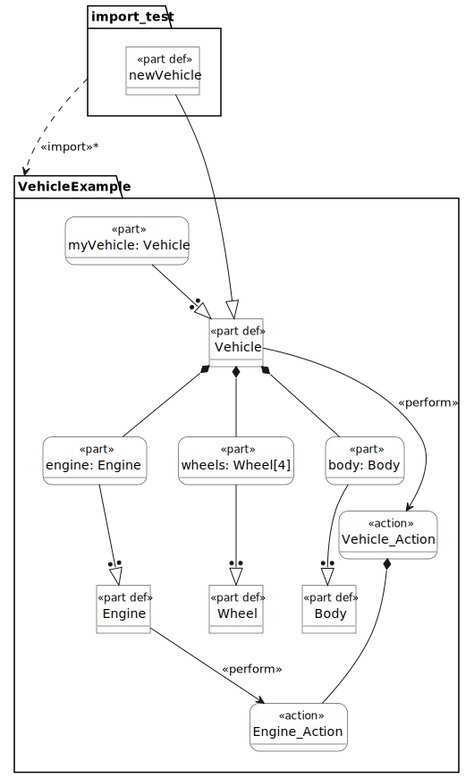
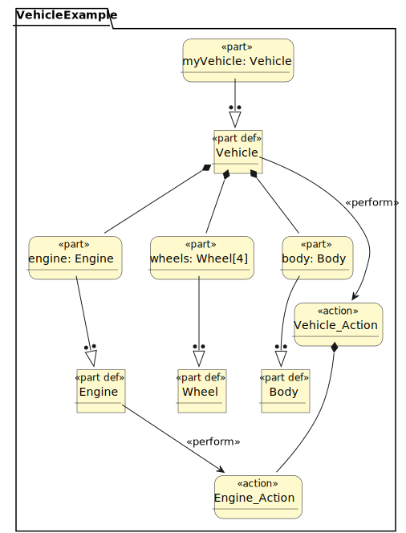
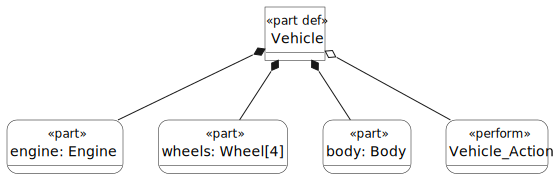
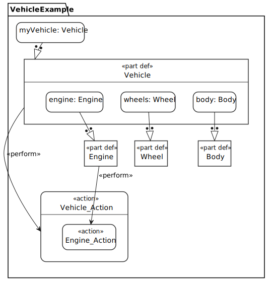
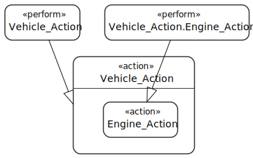

# SysML v2 Visualization Examples

## Generated Examples

### Multiple Package Tree View
**CLI Command:**
```bash
sysml-visualize import_test_VehicleExample_tree.svg --element "import_test VehicleExample" --view Tree
```

**Generated File:** `import_test_VehicleExample_tree.svg` (24,075 bytes)

**Description:** Tree view of both import_test and VehicleExample packages, showing inheritance relationships.



### Tree View with Standard Color
**CLI Command:**
```bash
sysml-visualize working_vehicle_tree_stdcolor.svg --view Tree --style stdcolor
```

**Generated File:** `working_vehicle_tree_stdcolor.svg` (20,963 bytes)

**Description:** Full package tree view with standard color styling, showing hierarchical structure of all elements.



### Tree View of Specific Element
**CLI Command:**
```bash
sysml-visualize working_vehicle_Vehicle_tree.svg --element "VehicleExample::Vehicle" --view Tree
```

**Generated File:** `working_vehicle_Vehicle_tree.svg` (8,661 bytes)

**Description:** Focused tree view of only the Vehicle part definition and its internal components.



### Interconnection View
**CLI Command:**
```bash
sysml-visualize working_vehicle_VehicleExample_interconnection.svg --element "VehicleExample" --view Interconnection
```

**Generated File:** `working_vehicle_VehicleExample_interconnection.svg` (15,651 bytes)

**Description:** Interconnection diagram showing relationships and connections between package elements.



### Action View
**CLI Command:**
```bash
sysml-visualize working_vehicle_action.svg --view Action
```

**Generated File:** `working_vehicle_action.svg` (5,890 bytes)

**Description:** Action-focused view highlighting behavioral elements and action flows in the model.



---